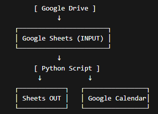

# Detalhes do projeto

## Objetivo

A automação tem o objetivo de ler um arquivo do Google Sheets e com base nele criar uma planilha excel mensal e criar eventos no Google calendar recorrentes com base na data e na hora.

## Arquitetura


## Bibliotecas necessárias para rodar o projeto
```bash
google-api-python-client
google-auth-httplib2
google-auth-oauthlib
pandas
```
<br><br>

# Orientações para rodar o projeto
## Ambiente virtual
- Criar o ambiente virtual
    ```bash
    python -m venv venv
    ```
- Ativar o ambiente virtual
    ```bash
    source venv/Scripts/activate
    ```
    OBS:  Se ativar corretamente vai aparecer algo assim:
    ```bash
    (venv) C:\Users\Bruno\controle_aulas> 
    ```
- Desativar o ambiente virtual
    ```bash
    deactivate
    ```
## Instalar as dependências do requirements.txt
```bash
pip install -r requirements.txt
```